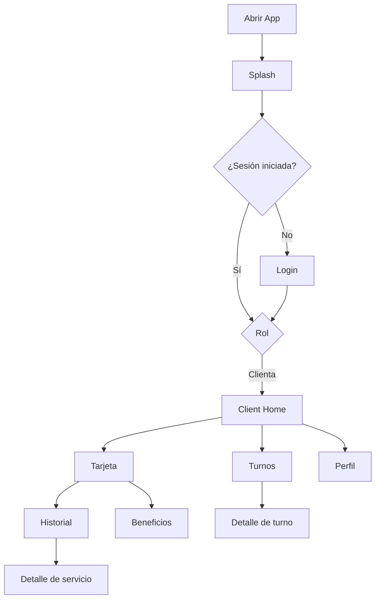
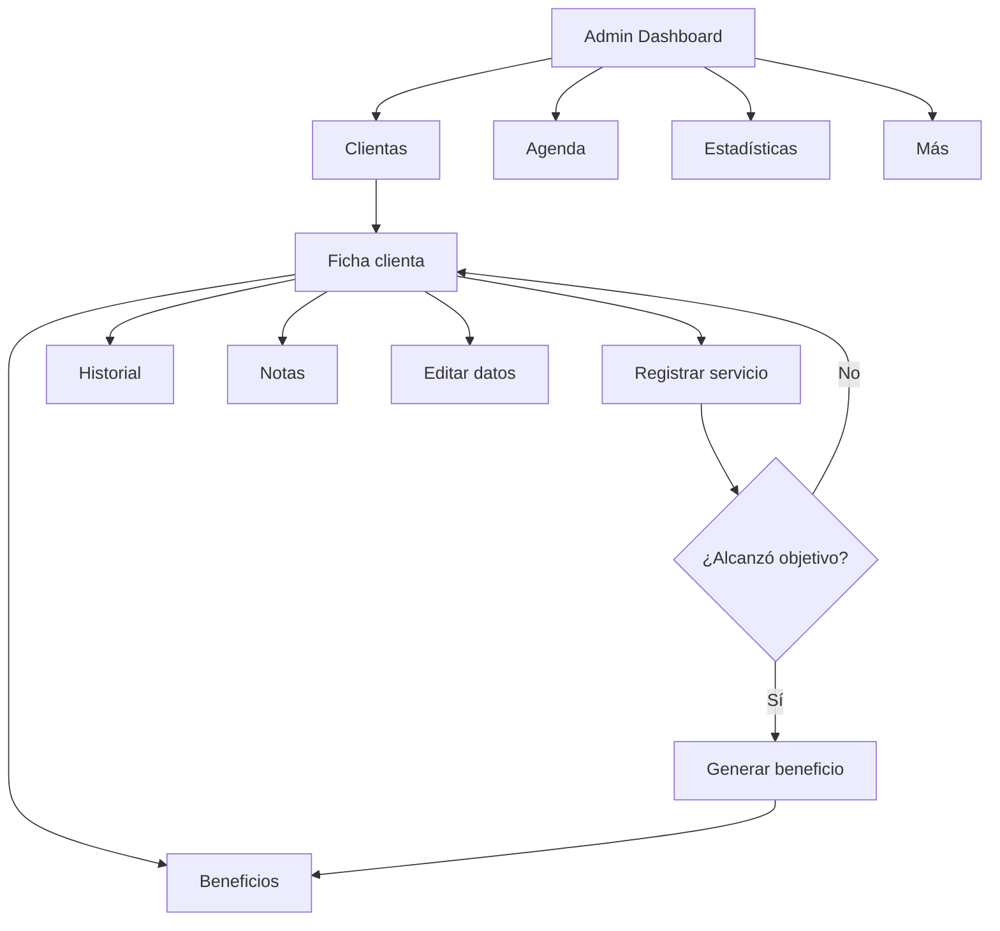
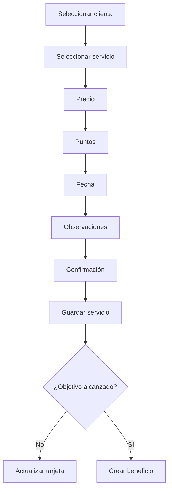

# User Flows

## Clienta

```mermaid
flowchart TD
    A[Abrir App] --> B[Splash]
    B --> C{¿Sesión iniciada?}
    C -- No --> D[Login]
    C -- Sí --> E{Rol}
    D --> E
    E -- Clienta --> F[Client Home]

    F --> G[Tarjeta]
    F --> H[Turnos]
    F --> I[Perfil]

    G --> J[Historial]
    G --> K[Beneficios]
    J --> L[Detalle de servicio]
    H --> M[Detalle de turno]
```

## Administradora

```mermaid
flowchart TD
    A[Admin Dashboard] --> B[Clientas]
    A --> C[Agenda]
    A --> D[Estadísticas]
    A --> E[Más]

    B --> F[Ficha clienta]
    F --> G[Registrar servicio]
    F --> H[Historial]
    F --> I[Beneficios]
    F --> J[Notas]
    F --> K[Editar datos]

    G --> L{¿Alcanzó objetivo?}
    L -- No --> F
    L -- Sí --> M[Generar beneficio]
    M --> I
```

## Registro de servicio

```mermaid
flowchart TD
    A[Seleccionar clienta] --> B[Seleccionar servicio]
    B --> C[Precio]
    C --> D[Puntos]
    D --> E[Fecha]
    E --> F[Observaciones]
    F --> G[Confirmación]
    G --> H[Guardar servicio]
    H --> I{¿Objetivo alcanzado?}
    I -- No --> J[Actualizar tarjeta]
    I -- Sí --> K[Crear beneficio]
```
