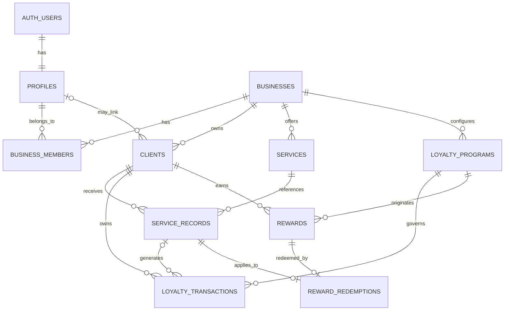

# Final MVP ERD

```mermaid
erDiagram
    AUTH_USERS ||--|| PROFILES : has
    BUSINESSES ||--o{ BUSINESS_MEMBERS : has
    PROFILES ||--o{ BUSINESS_MEMBERS : belongs_to
    BUSINESSES ||--o{ CLIENTS : owns
    PROFILES o|--o{ CLIENTS : may_link
    BUSINESSES ||--o{ SERVICES : offers
    BUSINESSES ||--o{ LOYALTY_PROGRAMS : configures
    CLIENTS ||--o{ SERVICE_RECORDS : receives
    SERVICES ||--o{ SERVICE_RECORDS : references
    CLIENTS ||--o{ LOYALTY_TRANSACTIONS : owns
    LOYALTY_PROGRAMS ||--o{ LOYALTY_TRANSACTIONS : governs
    SERVICE_RECORDS o|--o{ LOYALTY_TRANSACTIONS : generates
    CLIENTS ||--o{ REWARDS : earns
    LOYALTY_PROGRAMS ||--o{ REWARDS : originates
    REWARDS ||--o| REWARD_REDEMPTIONS : redeemed_by
    SERVICE_RECORDS ||--o| REWARD_REDEMPTIONS : applies_to
```
