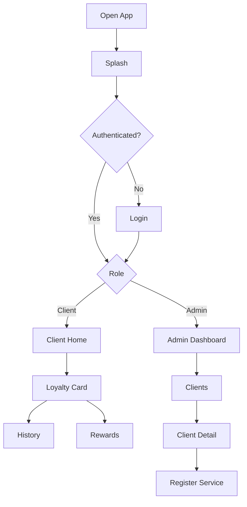

# User Flows

```mermaid
flowchart TD
    A[Open App] --> B[Splash]
    B --> C{Authenticated?}
    C -- No --> D[Login]
    C -- Yes --> E{Role}
    D --> E
    E -- Client --> F[Client Home]
    E -- Admin --> G[Admin Dashboard]
    F --> H[Loyalty Card]
    H --> I[History]
    H --> J[Rewards]
    G --> K[Clients]
    K --> L[Client Detail]
    L --> M[Register Service]
```
